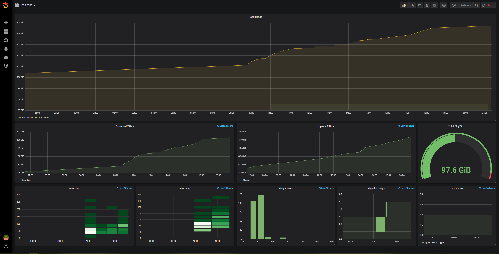

# playinternet

Set of quick scripts to monitor my internet usage from polish provider, Play.
Excuse to try out Selenium, Grafana and InfluxDB

Few parts might be useful:
- Deploy pre-configured Grafana on Docker
- Get statistics from Huawei B525 API
- Scrape usage from Play24 (if you reuse it, do this at reasonable rate)

Keep in mind that scripts have zero tests and minimal error handling.